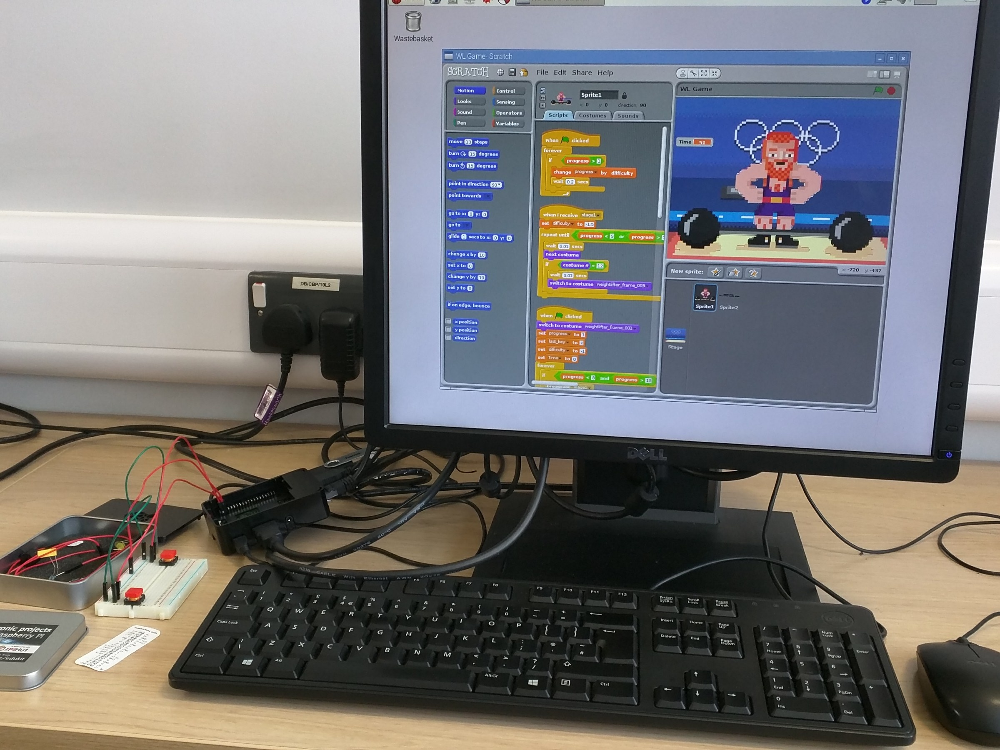
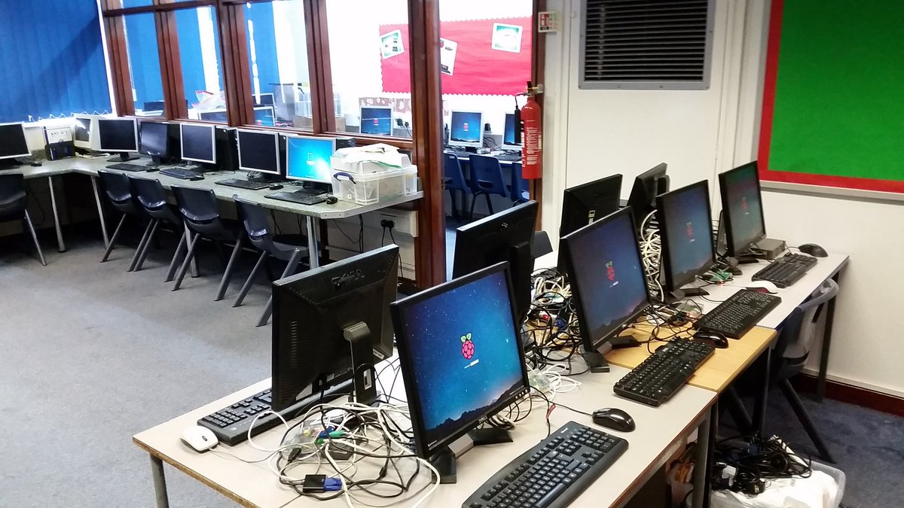

# Physical classroom setup

So you've got a class set of Raspberry Pis. It's time to unbox them and get your students exploring Linux and physical computing. You have a few main options when using Raspberry Pis in a classroom, which are detailed below.

## Option 1 - Use existing infrastructure

Raspberry Pis work well in existing IT suites, where there are already keyboards, mice, and monitors. As well as a class set of Raspberry Pis, you'll need:

1. A matching number of power supplies or USB A-to-micro-B cables
1. A matching number of SD cards

You can power a Raspberry Pi using either a micro USB power supply, or using the USB port of a computer. The computer will need to be switched on if you're choosing to power the Raspberry Pi this way.

Remove the HDMI cable and USB mouse and keyboard from the PC, and plug them into the Raspberry Pi.

If your monitors have VGA rather than HDMI connectors, you will also need one VGA-to-HDMI converter per monitor.

## Option 2 - Use a KVM switch

A Keyboard Video Monitor (KVM) switch allows you to control two different computers using the same peripherals.
You can purchase [KVM switches](http://www.ebuyer.com/store/Networking/cat/KVM-Switches) relatively cheaply if you shop around.

With a KVM switch, changing between using the Raspberry Pi and the PC can be accomplished with the push of a button. Simply connect the keyboard, mouse, and monitor to the KVM switch, and then connect both the Raspberry Pi and PC to the KVM switch.

## Option 3 - Use an all-in-one keyboard, mouse, and monitor

There are several pieces of equipment that can be used with the Raspberry Pi to provide a keyboard, monitor, and mouse. You might like to try a [Motorola Lapdoc](http://www.amazon.com/AT-Laptop-Dock-Motorola-ATRIX/dp/B004M17D62), a [pi-top](https://www.pi-top.com/), or a [NexDock](http://nexdock.com/).

## Option 4 - Remote setup

If these options don't suit your classroom, then you might like to consider using a [remote setup](remote.md).
