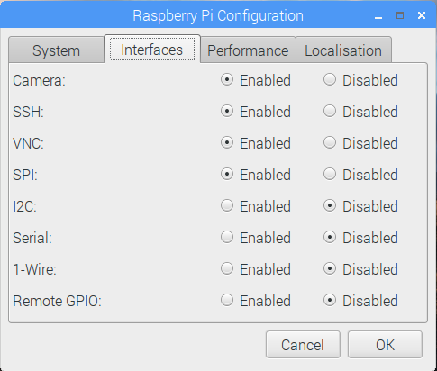

# Remote working on Raspberry Pis

## Option 1: Remote with VNC

As long as your Raspberry Pis are networked, either via WiFi or a network switch, you can operate them remotely from any existing networked computer.

Virtual Network Computing (VNC) is a protocol that allows you to control one computer from another computer. The advantage of using VNC is that you gain access to the full desktop of the Raspberry Pi, meaning you can use graphical programs from the connected computer.

- The first thing to do is to enable the VNC server on the Raspberry Pi. Raspbian comes preinstalled with [RealVNC](https://www.realvnc.com/).
- Click on `Menu`>`Preferences`>`Raspberry Pi Configuration`


- Then you need to **Enable** the VNC Server by clicking the `Enabled` Radio button.



- You should see the icon for the VNC Server in your menu bar.


- Your VNC Server will now start whenever the Pi is booted, and will continue to do so until you disable the VNC Server again.

- To connect to the Raspberry Pi from another computer, you can follow the instructions in one of the links below:

[On Windows, Linux and macOS](vnc-windows.md)  
[On Chrome OS](vnc-chromeos.md)  
[On iOS](vnc-ios.md)  

## Option 2 - Remote with SSH

If your students don't need access to a graphical user interface (GUI), then SSH is an easy way of connecting to, and using, Raspberry Pis.

### Linux-based operating systems

- If your students are using OS X or a Linux-based OS, then SSH is native to the operating system. Simply open a terminal and type:

``` bash
ssh pi@10.10.10.10
```

- Don't forget to replace 10.10.10.10 with the IP address of the Raspberry Pi.

- Then you can type in the password when prompted, usually `raspberry` unless you have changed it.

### Chrome OS and Chrome browser

- If your students are using Chrome OS or have access to the Chrome browser, then there's a Chrome app that allows access over SSH. You can find the Secure Shell App in the [Chrome Web Store](https://chrome.google.com/webstore/detail/secure-shell/pnhechapfaindjhompbnflcldabbghjo?hl=en).


- Once installed, click on the app to open it:


- Now you can access the Raspberry Pi by typing in the IP address:


- Then type in the password:


### PuTTY (on Windows)

PuTTY is an app that provides SSH access on Windows.

- Download PuTTY from [this site](http://www.chiark.greenend.org.uk/~sgtatham/putty/download.html).

- Once installed, you can open PuTTY from the Start menu and type in the IP address:


- If it's your first time connecting to this Raspberry Pi, you'll get a warning dialogue box, so click `Yes` to connect:


- Then you need to enter the username and password for the Raspberry Pi (usually `pi` and `raspberry`):


