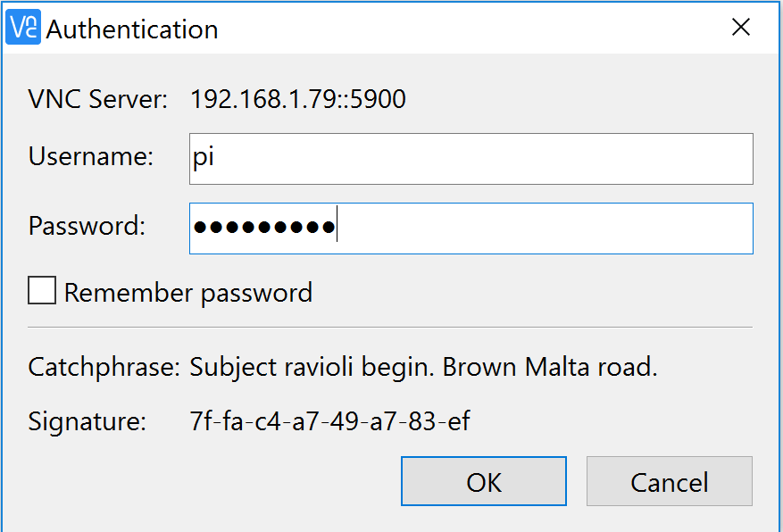

# VNC with Windows, Linux and macOS

There are many VNC viewers that can be downloaded and used with your main desktop computer. For simplicity's sake, the instructions below are for using REALVNC.

1. Download the client for your prefered operating system from the [REALVNC](https://www.realvnc.com/download/viewer) website.
2. Install the downloaded software
3. When you run the software for the first time you will be asked to accept the Terms and Condition.
4. You can now remote onto your Raspberry Pi, by typing it's IP address into the connection bar. If you don't know the IP address of your Raspberry Pi, you can find it by clicking on the REALVNC icon on the Raspberry Pi's desktop.

5. Next you'll be asked to authenticate. Type in your Raspberry Pi username and password (Default `pi` and `raspberry`).

6. You should now have a remote desktop session

